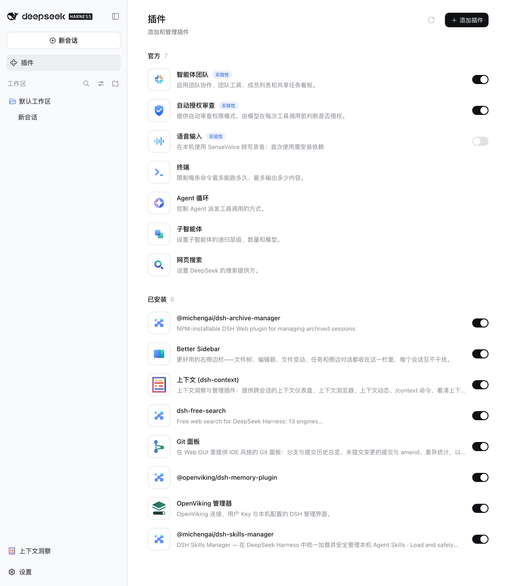
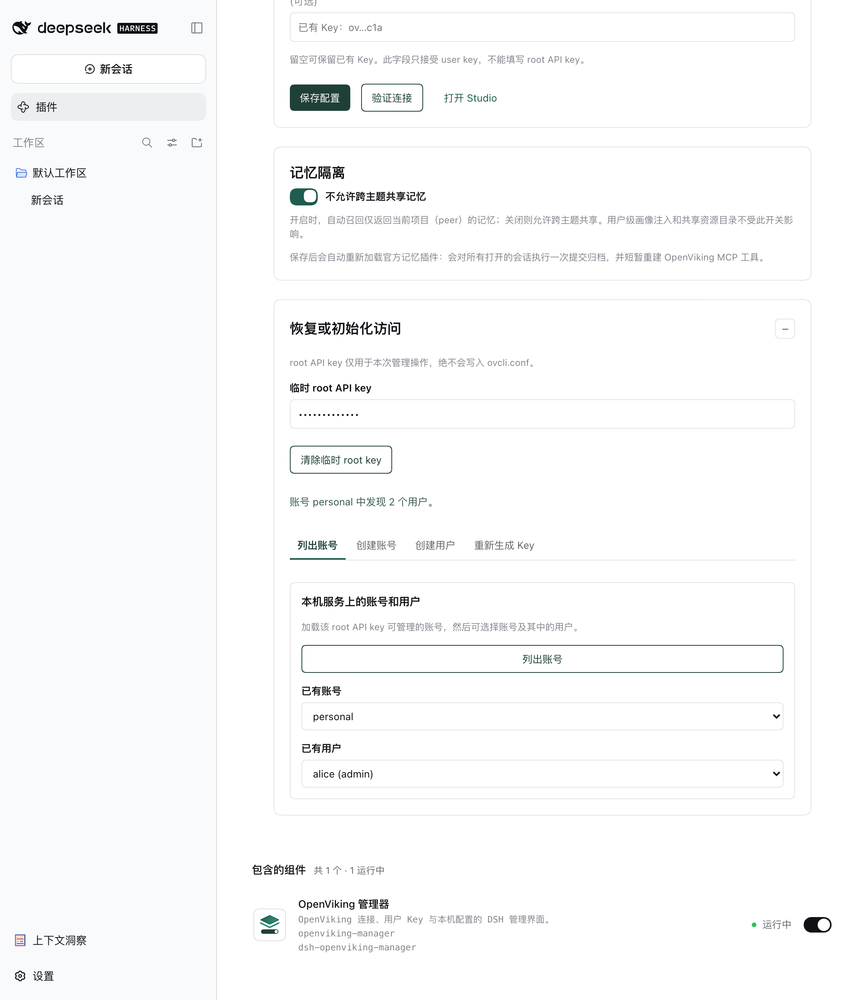
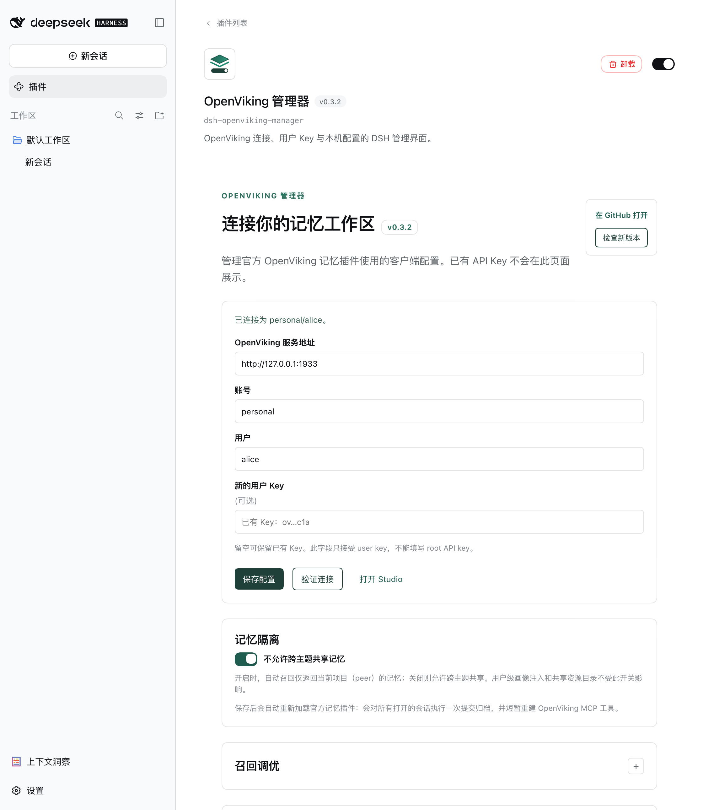
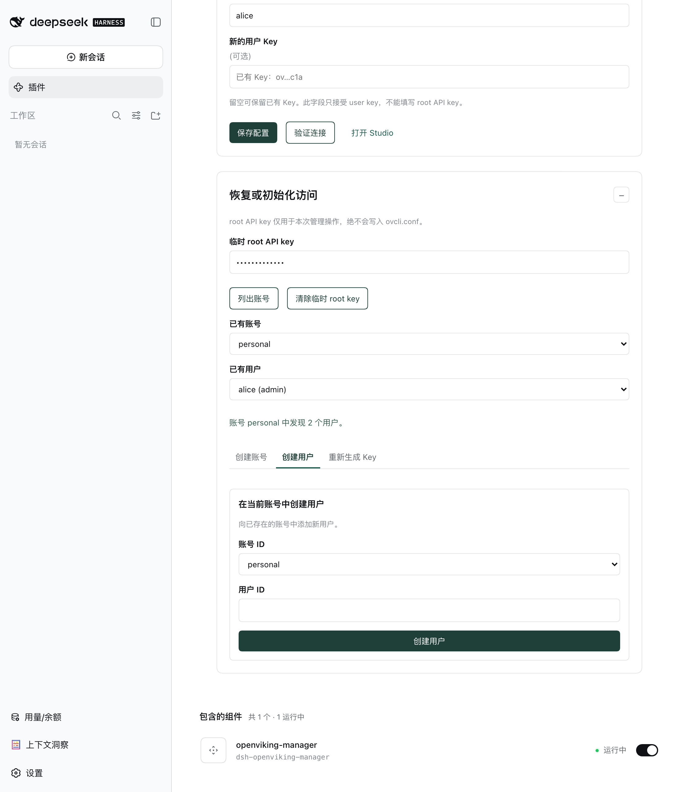

# dsh-openviking-manager

[English](README_EN.md) | 简体中文

`dsh-openviking-manager` 是一个 DSH Web UI 插件，用于管理已有 OpenViking 服务的客户端连接、用户 Key 和本机配置诊断，并提供会话级的 OpenViking 记忆开关。它只管理客户端配置与启停；记忆同步、提交和召回本身仍由官方 [`@openviking/dsh-memory-plugin`](https://www.npmjs.com/package/@openviking/dsh-memory-plugin) 负责。

OpenViking 是**火山引擎开源，专门给 AI Agent 设计的上下文数据库**，用来解决 Agent 长上下文、记忆、知识库管理问题。OpenViking 需要部署对应的服务端程序，服务支持远程访问和账号隔离，因此也适用于做跨设备、跨会话的远程记忆中心。本插件只是为 OpenViking 增加一个配置界面，便于管理本地的客户端配置。

OpenViking 的安装配置详见其官方网站：[DeepSeek Harness 记忆插件](https://docs.openviking.ai/zh/agent-integrations/17-dsh)

## 功能

- 读取、导入和原子更新 `~/.openviking/ovcli.conf`；
- 保留已有 `user_key`，页面仅显示掩码而不回传明文；
- 检查 OpenViking 的 `/health`、`/ready` 与用户身份；
- 检查 `ovcli.conf` 的 JSON 格式和文件权限，并提供经确认的权限修复；
- 本机发现：读取 `~/.openviking/ov.conf` 的非敏感状态，例如认证模式、是否存在 root key；`ovcli.conf` 始终优先；
- 临时使用 `root_api_key` 调用官方 Admin API：列账号、列用户、创建账号/用户、重新生成用户 Key；
- 根据当前 endpoint 推导 Studio 地址（`<endpoint>/studio`），允许用户手工改为反向代理地址；
- 会话级 OpenViking 开关：对话输入框左侧的按钮（默认开启）。关闭某个会话后，本插件会拦截官方插件在该会话的上下文注入、记忆写入/提交，并拒绝其 `mcp__openviking__*` 工具调用，使该会话不再读写 OpenViking；
- 跨主题记忆共享开关：写入官方 `ovcli.conf` 的 `plugin.recallPeerScope`（默认保持官方行为 `all` 允许跨主题共享；关闭为 `actor`，自动召回仅限当前项目 peer 的记忆），并提供"重启官方记忆插件"按钮让配置即刻生效；用户级画像注入与共享资源不受该开关影响；
- UI 跟随 DSH 系统语言设置，支持简体中文和英文。

## 界面

| 在 DSH 中 | 恢复与初始化 |
| :---: | :---: |
|  |  |
|  |  |

截图由 `npm run screenshots` 在一个隔离的 DSH 实例中生成，英文版见 [README_EN.md](README_EN.md)。

## 安全边界

- `root_api_key` 只在浏览器表单和一次同源管理请求期间使用，绝不写入 `ovcli.conf`；创建/轮换完成后插件会清空该输入。
- 现有 `user_key` 从服务端本地读取，浏览器只收到掩码；连接验证可在不回显旧 key 的情况下完成。
- 多数管理路由仅接受同源请求，响应使用 `no-store`，且不在日志中记录请求头。
- 会话开关状态仅保存在插件进程内存中，重启 DSH 后所有会话恢复默认开启。
- 关闭只对之后的 agent step 生效：历史消息里已注入的 OpenViking 上下文在被压缩前仍留在该会话中；关闭期间官方插件此前排队的待提交写入仍可能由其全局恢复逻辑补发。本插件不启动、停止或修改 OpenViking 服务端，也不替换官方记忆插件。
- 跨主题共享开关只写官方声明的 `plugin.recallPeerScope` 键，保留 `ovcli.conf` 中的一切未知键；"重启官方记忆插件"只经宿主 Cordis 公开机制重载官方插件使其重读配置，不修改官方代码，副作用是对打开的会话做一次提交归档并短暂重建 MCP 工具；官方插件未加载时会提示手动重启 DSH。环境变量 `OPENVIKING_RECALL_PEER_SCOPE` 优先级更高，页面会显示其覆盖警告。

## 安装

```bash
# 安装 openviking 的官方插件
dsh plugin --profile web add @openviking/dsh-memory-plugin
# 安装配置管理器
dsh plugin --profile web add dsh-openviking-manager
# 也可以直接从 GitHub 仓库安装或者从 file 安装
dsh plugin --profile web add github:xbzbing/dsh-openviking-manager
```

安装后可能需要重启对应的 DSH profile，在 DSH 插件页面可以看到`openviking-manager`的配置管理页面。

## 环境要求

- Node.js `>= 22`
- DSH `>= 0.1.6-alpha.2 < 0.2.0`
- 一个可访问的 OpenViking 服务
- 官方 `@openviking/dsh-memory-plugin` `>= 0.3.2`（不设上限；本仓库已完整测试至 `0.5.0`）

## 开发

```bash
npm ci
npm run build       # 生成 lib/ 编译产物，不会生成 .tgz
npm test            # 单元测试 + Playwright E2E
```

`lib/` 是随 git 分发的编译产物，改动 `src/` 后必须重新构建并提交，否则从 GitHub 安装会加载到缺失或过期的入口。`lib/standalone.js` 仅供 Playwright 使用，不提交也不随包发布。仓库不会在构建流程中生成或保留 `.tgz` 安装包。

## 测试

```bash
npm run test:unit
npm run test:e2e
```

Playwright E2E 覆盖导入并保存 `ovcli.conf`、非法 endpoint 保护、服务端 user key 验证、临时 root key 的账号/用户选择，以及中文浏览器语言渲染。

## 项目结构

```text
src/
  ovcli-config.ts       ovcli.conf 读取、校验、原子写入和权限修复
  local-discovery.ts    ov.conf 非敏感发现
  openviking-client.ts  数据面连通性与身份验证
  openviking-admin.ts   官方 Admin API 适配
  manager-api.ts        DSH 同源 HTTP 路由（含会话开关）
  session-toggle.ts     会话级 OpenViking 开关的内存状态
  ov-prestep.ts         识别并剥离官方插件注入的 pre-step 消息
  ov-tool-guard.ts      关闭会话对 mcp__openviking__* 工具的拒绝
  openviking-gate.ts    对官方 OpenVikingRuntime 的按会话短路包装
  client/               DSH Web 页面、输入框开关按钮、样式和 i18n
```

## 许可证

本项目采用 [MIT License](LICENSE)。
