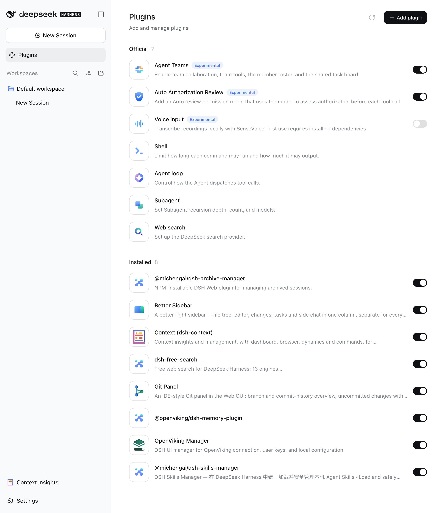
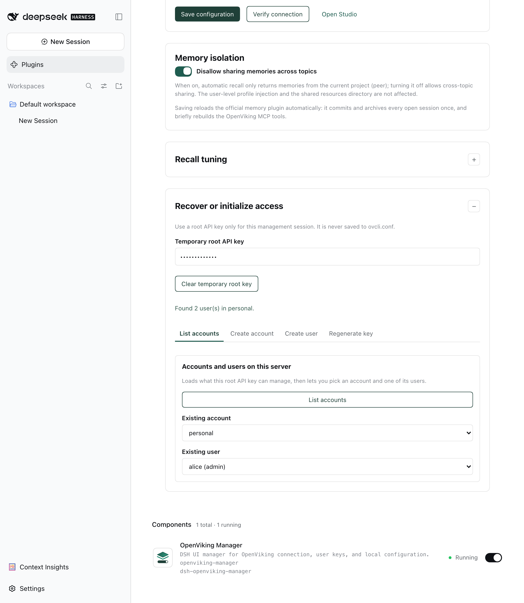
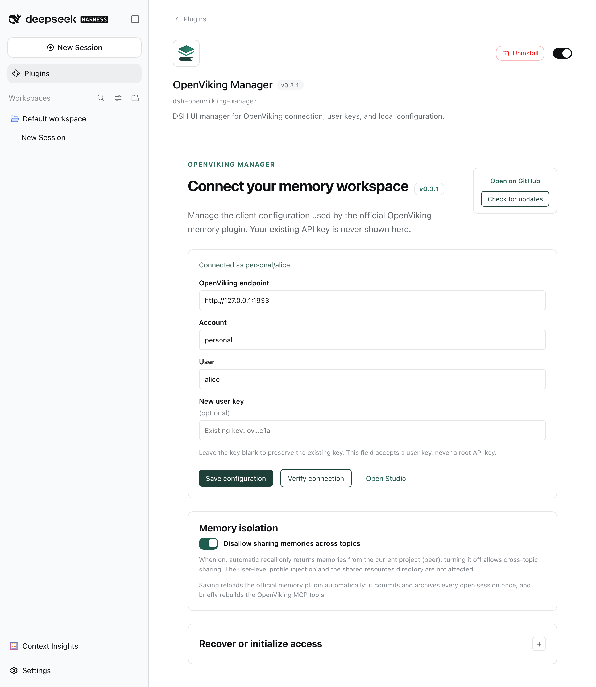
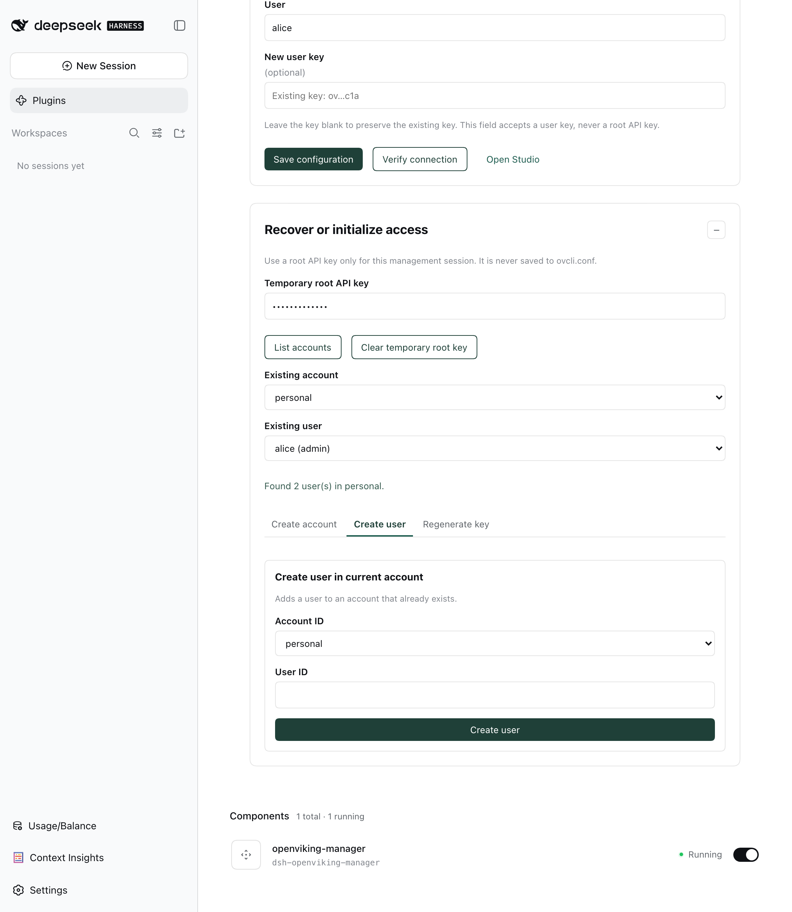

# dsh-openviking-manager

English | [简体中文](README.md)

`dsh-openviking-manager` is a DSH Web UI plugin for managing an existing OpenViking service connection, user keys, and local configuration diagnostics, plus a per-session OpenViking memory toggle. It manages client configuration and enablement only; memory synchronization, commit, and recall remain the responsibility of the official [`@openviking/dsh-memory-plugin`](https://www.npmjs.com/package/@openviking/dsh-memory-plugin).

OpenViking is an **open-source context database from Volcengine, purpose-built for AI agents**, solving long-context, memory, and knowledge-base management for agents. It requires deploying the corresponding server; because the service supports remote access and account isolation, it also serves as a remote memory hub shared across devices and sessions. This plugin only adds a configuration UI for OpenViking, to make the local client configuration easier to manage.

See the official documentation for installing and configuring OpenViking: [DeepSeek Harness Memory Bundle](https://docs.openviking.ai/en/agent-integrations/17-dsh)

## Features

- Read, import, and atomically update `~/.openviking/ovcli.conf`.
- Preserve an existing `user_key`; the browser receives a masked value only.
- Check OpenViking `/health`, `/ready`, and authenticated user identity.
- Detect malformed JSON and unsafe `ovcli.conf` permissions; offer a confirmed local permission repair.
- Local discovery reads non-sensitive `~/.openviking/ov.conf` state, such as authentication mode and root-key availability. `ovcli.conf` always takes precedence.
- Temporarily use a `root_api_key` with the official Admin API to list accounts/users, create accounts/users, and rotate a user key.
- Derive the Studio URL as `<endpoint>/studio`; users can override it for a reverse proxy.
- Per-session OpenViking toggle: a button on the left of the conversation input toolbar (on by default). Turning a session off makes this plugin intercept the official plugin's context injection and memory writes/commits for that session and deny its `mcp__openviking__*` tool calls, so the session no longer reads or writes OpenViking.
- Follow the DSH system language setting with Simplified Chinese and English UI dictionaries.

## Screenshots

| In DSH | Recovery and initialization |
| :---: | :---: |
|  |  |
|  |  |

Screenshots are captured from an isolated DSH instance by `npm run screenshots`; the Simplified Chinese set lives in [README.md](README.md).

## Security boundaries

- `root_api_key` is used only for the current browser form and a same-origin management request. It is never written to `ovcli.conf`; the form is cleared after creation or key rotation succeeds.
- An existing `user_key` is read locally by the server and never returned to the browser in plaintext. Connection verification works without exposing that key.
- Management routes accept same-origin requests only, use `no-store` responses, and do not log authorization headers.
- Toggle state lives only in plugin process memory; restarting DSH resets every session to the default (on).
- Turning a session off only affects subsequent agent steps: OpenViking context already injected into history remains until compaction, and writes the official plugin queued while the session was on may still be replayed by its global recovery. This plugin does not start, stop, or reconfigure the OpenViking server, and does not replace the official memory plugin.

## Install

```bash
# Install the official OpenViking plugin
dsh plugin --profile web add @openviking/dsh-memory-plugin
# Install the configuration manager
dsh plugin --profile web add dsh-openviking-manager
# You can also install straight from the GitHub repository, or from a local file path
dsh plugin --profile web add github:xbzbing/dsh-openviking-manager
```

Restarting the corresponding DSH profile may be required afterwards; the `openviking-manager` configuration page is then available on the DSH plugins page.

## Requirements

- Node.js `>= 22`
- DSH `>= 0.1.6-alpha.2 < 0.2.0`
- A reachable OpenViking service
- Official `@openviking/dsh-memory-plugin` `>= 0.3.2` (no upper bound; this repository has been fully tested through `0.5.0`)

## Development

```bash
npm ci
npm run build       # Generates lib/; no .tgz is produced
npm test            # Unit tests + Playwright E2E
```

`lib/` ships through git, so after changing `src/` you must rebuild and commit it; otherwise a GitHub install loads a missing or stale entry point. `lib/standalone.js` exists only for Playwright: it is neither committed nor published. The build workflow neither creates nor retains a `.tgz` package.

## Tests

```bash
npm run test:unit
npm run test:e2e
```

The Playwright suite covers `ovcli.conf` import and save, invalid endpoint protection, server-side user-key validation, temporary-root-key account/user selection, and Chinese browser-language rendering.

## Project layout

```text
src/
  ovcli-config.ts       ovcli.conf read, validation, atomic writes, permissions
  local-discovery.ts    non-sensitive ov.conf discovery
  openviking-client.ts  data-plane connection and identity validation
  openviking-admin.ts   official Admin API adapter
  manager-api.ts        DSH same-origin HTTP routes (including session toggle)
  session-toggle.ts     in-memory per-session OpenViking toggle state
  ov-prestep.ts         identify and strip official-plugin pre-step injections
  ov-tool-guard.ts      deny mcp__openviking__* tools while a session is off
  openviking-gate.ts    per-session short-circuit wrapper over OpenVikingRuntime
  client/               DSH Web UI, input-bar toggle button, styles, i18n
```

## License

[MIT License](LICENSE).
